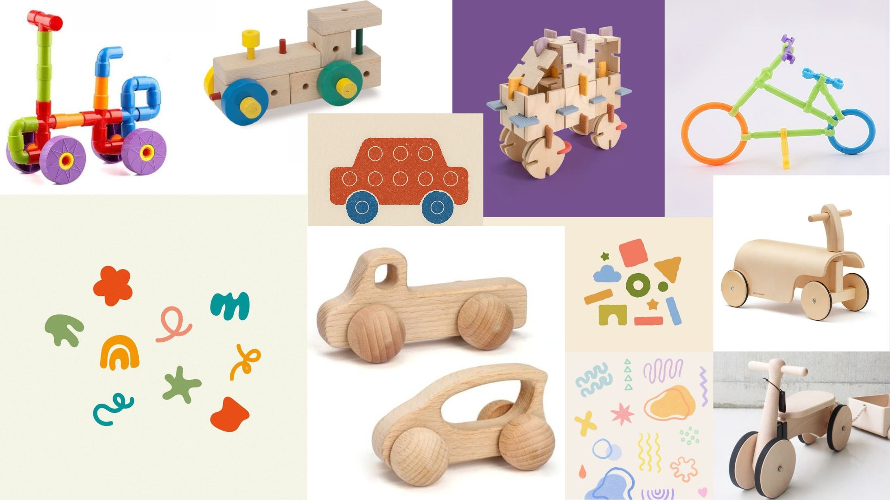

# Wood Wheels

<!--
  HERO: idealmente uma pseudo-sessão fotográfica do produto
  (ver tutorial Pletor.ai nos Recursos da disciplina, em
  /Recursos/AI_exps/). Usa attachments/hero.jpg para o frontmatter.
-->

>WOOD WHEELS é um carrinho de madeira sustentável que, através de peças de encaixe, estimula a imaginação, o movimento e a aprendizagem.

A página deve tornar **visualmente percetível** a estratégia de resposta ao enunciado.
Segue a estrutura de **prancha-resumo** + **esquema-base** (C-E-T-F).

## Conceito

O WOOD WHEELS é um carrinho de madeira sustentável desenvolvido para crianças, que combina movimento e peças de encaixe numa experiência de brincadeira educativa e interativa.

O produto é fabricado a partir do reaproveitamento de madeira, promovendo uma utilização mais consciente dos recursos e reduzindo o desperdício de matéria-prima. A produção recorre à tecnologia de corte CNC, que permite obter peças com elevada precisão, qualidade e segurança, garantindo simultaneamente um processo de fabrico eficiente e sustentável.

Pensado para estimular a coordenação motora, a criatividade e a imaginação, o WOOD WHEELS incentiva a aprendizagem através da exploração, da montagem e da interação. O seu design simples e intuitivo reflete os valores da NESTOR, aliando sustentabilidade, educação e criatividade numa única experiência de brincadeira.

**O que é?** Um carrinho de madeira com peças de encaixe produzido através de corte CNC.

**Para quem?** Crianças em idade pré-escolar e escolar.

**Porquê?** Para promover o desenvolvimento infantil através da brincadeira, valorizando a sustentabilidade, a aprendizagem e a criatividade.

## Enquadramento

O desenvolvimento do **WOOD WHEELS** surge no âmbito de um projeto focado na recolha e redesenho de objetos, com o objetivo de explorar novas soluções de produto através do reaproveitamento de materiais e da aplicação de processos de fabrico sustentáveis.
Mais do que um simples carrinho, o **WOOD WHEELS** diferencia-se pela integração de peças de encaixe que convidam a criança a participar ativamente na construção do brinquedo antes da sua utilização. Esta interação promove a aprendizagem através da experimentação e da descoberta, transformando cada momento de brincadeira numa experiência educativa.(ver [contexto](../../contexto.md))

## Tecnologia

O desenvolvimento do **WOOD WHEELS** integra-se num sistema de produção sustentável que procura otimizar a utilização de material excedente proveniente da indústria do mobiliário. O projeto baseia-se no aproveitamento das áreas não utilizadas dos planos de corte CNC, transformando resíduos de produção em brinquedos educativos com valor funcional e ambiental.

A matéria-prima utilizada resulta do reaproveitamento de madeira proveniente destes processos, promovendo uma utilização mais eficiente dos recursos e contribuindo para a redução do desperdício.

O fabrico das peças é realizado através de corte CNC, tecnologia que garante elevada precisão, qualidade de acabamento e eficiência produtiva. A integração dos componentes do brinquedo nos espaços livres dos planos de corte permite maximizar o aproveitamento do material disponível sem interferir com a produção principal.

O desenvolvimento do produto foi realizado com recurso ao **Autodesk Fusion 360**, uma ferramenta de modelação 3D e desenho paramétrico que permitiu conceber, testar e otimizar as diferentes peças de encaixe do carrinho. A utilização deste software possibilitou a criação de modelos digitais precisos e a preparação dos respetivos ficheiros técnicos para fabrico.

- Modelo 3D: 
<iframe  
src="https://a360.co/4e2O2kb"  
width="100%"  
height="700"  
frameborder="0">  
</iframe>
- Ficheiros: `attachments/`

## Função

O **WOOD WHEELS** é um brinquedo educativo em madeira que combina um sistema de peças de encaixe com a funcionalidade de um carrinho. A brincadeira inicia-se com a montagem das diferentes peças, permitindo à criança desenvolver a coordenação motora fina, a perceção espacial e a capacidade de resolução de problemas. Após a montagem, o brinquedo pode ser utilizado livremente como carrinho, estimulando o movimento, a imaginação e a criação de narrativas durante a brincadeira.

O produto foi concebido para crianças a partir dos **3 anos de idade**, faixa etária em que as competências motoras e cognitivas necessárias para a manipulação das peças se encontram em desenvolvimento.

A montagem é simples e intuitiva, sendo realizada através de um sistema de encaixe que não requer ferramentas nem elementos adicionais. As peças foram desenhadas para proporcionar uma experiência segura, resistente e adequada à utilização infantil.

O desenvolvimento do produto considera os requisitos estabelecidos pela **Diretiva 2009/48/CE relativa à segurança dos brinquedos**, nomeadamente no que respeita à utilização de materiais adequados, à ausência de arestas perigosas, à dimensão das peças e à segurança durante a utilização. Desta forma, o WOOD WHEELS procura garantir uma experiência de brincadeira segura, educativa e alinhada com as normas europeias aplicáveis aos brinquedos destinados ao público infantil.

## Apresentação

## Processo

O percurso completo de iterações, modelos e pesquisa está em [processo.md](processo.md), organizado do **mais recente** para o **mais antigo**.

[Ver processo completo →](processo.md)
